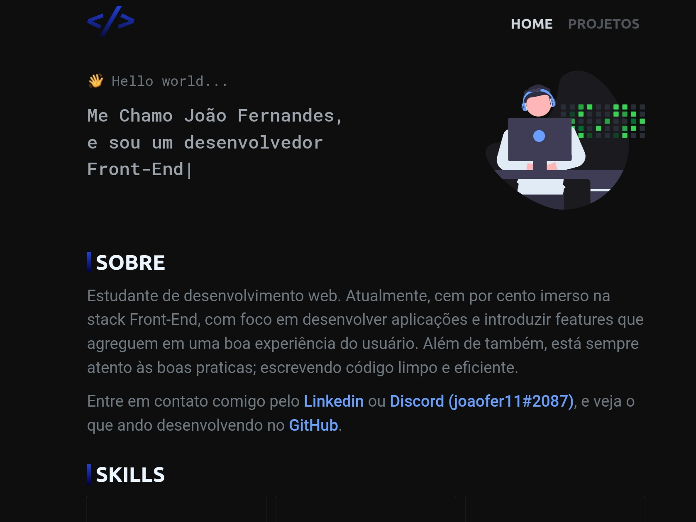

<h1>
  Portfólio
</h1>

<p>
  
  
  
</p>
<p>
  <a href="#-sobre">Sobre</a> &nbsp;|&nbsp;
  <a href="#-tecnologias">Tecnologias</a> &nbsp;|&nbsp;
  <a href="#-executando-à-aplicação">Executando à aplicação</a>
</p>

<br>

## 📝 &nbsp;Sobre
Aplicação Web simples desenvolvida com o intuito de servir como portfólio,
utilizando **React** e **TypeScript**.



<br>

## 🛠 &nbsp;Tecnologias

As seguintes tecnologias foram utilizadas no desenvolvimento do projeto:

- [React](https://reactjs.org/)
- [TypeScript](https://www.typescriptlang.org/)
- [Styled Components](https://styled-components.com/)
- [ESLint](https://eslint.org/)

<br>

## 🚀 &nbsp;Executando à Aplicação

Para executar à aplicação, você vai precisar instalar o [Node](https://nodejs.org/en/).

Feito isso, execute os passos a suguir:

```bash
# Abra um terminal, e tenha acesso a este repositório com o seguinte comando:
$ git clone https://github.com/joaofer11/portfolio.git
# ou use a opção de download e extraia manualmente.

# Entre na pasta
$ cd portfolio

# Instale as dependências
$ npm install

# Execute à aplicação:
$ npm run dev
```

---

Feito por [João Fernandes](https://github.com/joaofer11)

[](https://www.linkedin.com/in/jo%C3%A3o-fernandes-569461253/) 
[](mailto:joaofergear003@gmail.com)
